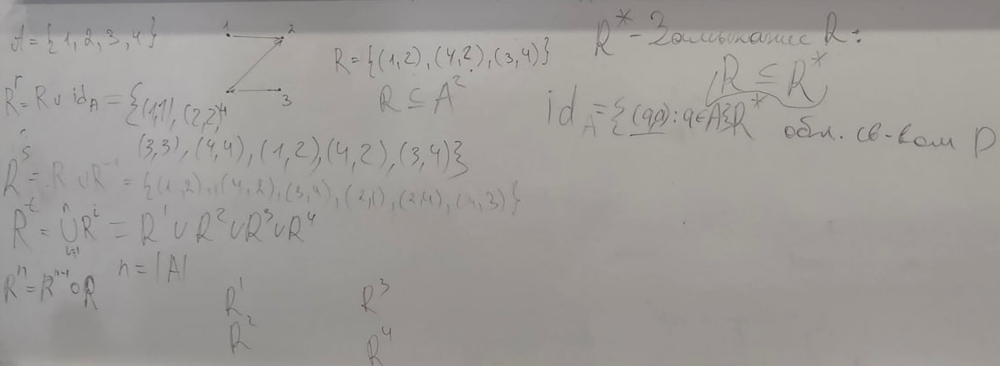
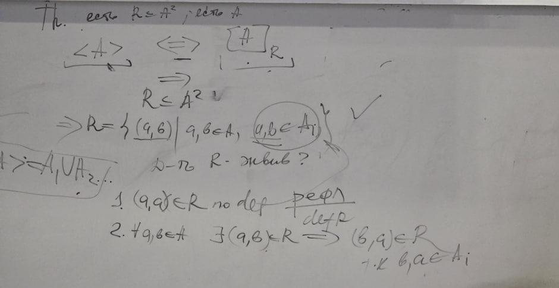

# Композиция и замыкания отношений, разбиения и соответствия

**Дата занятия:** 06.10.2026.

## Конспект

### 1. Композиция отношений

Пусть отношение $R$ связывает элементы множества $A$ с элементами $B$, а отношение $S$ — элементы $B$ с элементами $C$:

```math
R\subseteq A\times B,\qquad S\subseteq B\times C.
```

**Композиция** связывает начало и конец двух последовательных связей. В обозначениях этой записи сначала идём по $R$, затем по $S$:

```math
R\circ S=
\lbrace(a,c)\in A\times C\mid
\exists b\in B:\ (a,b)\in R\ \land\ (b,c)\in S\rbrace.
```

То есть пара $(a,c)$ входит в композицию, если найдётся хотя бы один промежуточный элемент $b$, через который можно пройти из $a$ в $c$.

```math
a\xrightarrow{R}b\xrightarrow{S}c
\quad\Longrightarrow\quad (a,c)\in R\circ S.
```

**Пример для пояснения.** Возьмём:

```math
R=\lbrace(1,b),(2,b)\rbrace,\qquad
S=\lbrace(b,c),(b,d)\rbrace.
```

Из 1 можно пройти через $b$ как в $c$, так и в $d$. Для 2 получаются такие же два продолжения. Поэтому:

```math
R\circ S=\lbrace(1,c),(1,d),(2,c),(2,d)\rbrace.
```

Если до одного и того же конца ведут несколько подходящих промежуточных элементов, итоговая пара всё равно записывается **один раз**: отношение — множество пар, а не список маршрутов.

> **Обратите внимание.** Здесь $R\circ S$ означает «сначала $R$, потом $S$», как в присланной записи. В другой системе обозначений порядок может быть обратным. Ориентируйся на определение композиции, а не только на символ.

#### Порядок множителей и скобки

Композиция в общем случае **не коммутативна**. Пример на множестве $\lbrace1,2\rbrace$:

```math
R=\lbrace(1,2)\rbrace,\qquad S=\lbrace(2,1)\rbrace;
\qquad
R\circ S=\lbrace(1,1)\rbrace,\qquad
S\circ R=\lbrace(2,2)\rbrace.
```

При этом композиция **ассоциативна**:

```math
(R\circ S)\circ T=R\circ(S\circ T).
```

Если $T$ связывает $C$ с $D$, обе стороны означают существование одной и той же цепочки:

```math
a\xrightarrow{R}b\xrightarrow{S}c\xrightarrow{T}d.
```

Скобки определяют, какие два шага мы сначала объединяем в одну связь; итоговые пары $(a,d)$ от этого не меняются.

> **Обратите внимание.** Ассоциативность разрешает переставлять скобки, но не менять порядок $R$, $S$, $T$.

### 2. Степени отношения

Для отношения **на одном множестве** $A$ можно последовательно проходить по одному и тому же отношению:

```math
R\subseteq A^2,\qquad A^2=A\times A;
\qquad
R^1=R,\qquad R^{k+1}=R^k\circ R\quad(k\ge1).
```

- $R^1$ — пары, связанные одним шагом.
- $R^2$ — пары, между которыми существует путь ровно из двух шагов.
- $R^3$ — пары, между которыми существует путь ровно из трёх шагов.
- Аналогично определяется любая положительная степень.

Промежуточные вершины могут повторяться: например, цикл позволяет снова вернуться в начальную вершину. Это не обычная числовая степень: мы повторяем **композицию отношений**.

> **Обратите внимание.** $R^k$ описывает пути **ровно** длины $k$. Пары, достижимые за разное положительное число шагов, собираются объединением степеней.

### 3. Замыкания отношений

**Замыкание по свойству** — наименьшее по включению отношение, которое содержит исходное $R$ и обладает нужным свойством. Исходные пары сохраняются; добавляются только необходимые.

На доске используется общее обозначение $R^{\ast}$. Оно само по себе не сообщает, какое свойство требуется: это нужно указать отдельно.

> **Запись на доске (фото 1).** «Замыкание R».



*Фото 1 · 06.10.2026 — Рефлексивное, симметричное и транзитивное замыкания; степени отношения.*

#### Рефлексивное замыкание

Рефлексивность требует, чтобы каждый элемент был связан с собой. Обозначим диагональное, или тождественное, отношение:

```math
\mathrm{id}_A=\lbrace(a,a)\mid a\in A\rbrace.
```

Добавляем к $R$ все диагональные пары:

```math
R^r=R\cup\mathrm{id}_A.
```

Уже имеющиеся петли повторно не учитываются. Других пар для рефлексивности добавлять не требуется.

#### Симметричное замыкание

Обратное отношение получается переворачиванием каждой пары:

```math
R^{-1}=\lbrace(b,a)\mid(a,b)\in R\rbrace.
```

Симметричное замыкание:

```math
R^s=R\cup R^{-1}.
```

Теперь вместе с любой парой $(a,b)$ есть $(b,a)$. Если обратная пара уже была, ничего нового для неё не добавляем.

#### Транзитивное замыкание

Транзитивность требует прямой связи между началом и концом любой цепочки из двух связей. После добавления такой пары могут появиться новые цепочки, поэтому нужно учесть пути **любой положительной длины**:

```math
R^t=\bigcup_{k\ge1}R^k.
```

Для конечного множества из $n$ элементов достаточно:

```math
n=|A|,\qquad R^t=R^1\cup R^2\cup\dots\cup R^n.
```

Почему достаточно этих степеней: из пути между разными вершинами можно убрать повторяющиеся участки и оставить не более $n-1$ шагов. Для возврата в ту же вершину достаточно цикла длины не более $n$. Поэтому более длинные пути не дают новых достижимых пар.

> **Обратите внимание.** В транзитивное замыкание петли попадают только тогда, когда они уже есть или возникают из цикла. Все диагональные пары автоматически добавляет рефлексивное замыкание, а не транзитивное.

#### Полный разбор примера с доски

```math
A=\lbrace1,2,3,4\rbrace,\qquad
R=\lbrace(1,2),(4,2),(3,4)\rbrace.
```

Связи: $1\to2$ и $3\to4\to2$. Из вершины 2 продолжения нет.

**Рефлексивное замыкание:** добавляем четыре петли:

```math
R^r=\lbrace
(1,1),(2,2),(3,3),(4,4),(1,2),(4,2),(3,4)
\rbrace.
```

**Симметричное замыкание:** к трём исходным парам добавляем три обратные:

```math
R^s=\lbrace
(1,2),(4,2),(3,4),(2,1),(2,4),(4,3)
\rbrace.
```

**Транзитивное замыкание:** вычисляем степени.

| Степень | Пары | Причина |
|---|---|---|
| $R^1$ | $(1,2),(4,2),(3,4)$ | Исходные связи |
| $R^2$ | $(3,2)$ | Единственная цепочка из двух шагов: $3\to4\to2$ |
| $R^3$ | $\varnothing$ | После двух шагов оказываемся в 2, откуда нельзя продолжить |
| $R^4$ | $\varnothing$ | Путей длины 4 также нет |

Объединяем:

```math
R^t=\lbrace(1,2),(4,2),(3,4),(3,2)\rbrace.
```

После добавления $(3,2)$ транзитивность выполнена: единственная требующая прямого продолжения цепочка $3\to4\to2$ уже имеет связь $3\to2$.

**Почему важна граница степеней.** Границу $n$ нельзя всегда заменить на $n-1$. Дополнительный пример: на двух элементах отношение $\lbrace(1,2),(2,1)\rbrace$ содержит цикл. Вторая степень добавляет $(1,1)$ и $(2,2)$; первая степень их не содержит.

> **Обратите внимание.** Слова «содержит $R$ и имеет свойство» недостаточно для замыкания: важно ещё быть **наименьшим** таким отношением. Добавлять произвольные лишние пары нельзя.

### 4. Разбиение множества

**Разбиение** множества $A$ — семейство его частей, или блоков, со следующими условиями:

```math
A_i\ne\varnothing;
\qquad A_i\cap A_j=\varnothing\quad(i\ne j);
\qquad \bigcup_{i\in I}A_i=A.
```

Каждый блок непустой; разные блоки не пересекаются; вместе они покрывают всё множество. Следовательно, каждый элемент принадлежит **ровно одному** блоку.

**Пример для пояснения:** множество $\lbrace1,2,3,4\rbrace$ разбито на $\lbrace1,2\rbrace$ и $\lbrace3,4\rbrace$.

Зададим отношение правилом «элементы находятся в одном блоке»:

```math
aRb\quad\Longleftrightarrow\quad
\exists i\in I:\ a\in A_i\ \land\ b\in A_i.
```

В примере оно состоит из восьми пар:

```math
R=\lbrace(1,1),(1,2),(2,1),(2,2),
(3,3),(3,4),(4,3),(4,4)\rbrace.
```

Между разными блоками связей нет; внутри каждого блока связаны все упорядоченные пары, включая петли.

### 5. Разбиения и отношения эквивалентности

**Теорема:** разбиение определяет отношение эквивалентности «лежать в одном блоке», а классы любого отношения эквивалентности образуют разбиение.



*Фото 2 · 06.10.2026 — Связь разбиения с классами эквивалентности; начало доказательства рефлексивности и симметричности.*

#### Из разбиения получаем эквивалентность

Проверяем три свойства отношения из предыдущего раздела.

**Рефлексивность.** Каждый $a\in A$ принадлежит своему блоку. Значит, $a$ и $a$ лежат в одном блоке, поэтому $(a,a)\in R$.

**Симметричность.** Если $a$ и $b$ лежат в одном блоке, то $b$ и $a$ лежат в том же блоке. Из $(a,b)\in R$ следует $(b,a)\in R$.

**Транзитивность.** Пусть $aRb$ и $bRc$. Тогда:

```math
a,b\in A_i,\qquad b,c\in A_j.
```

Элемент $b$ принадлежит обоим блокам. Разные блоки разбиения не пересекаются, поэтому это один и тот же блок. В нём лежат и $a$, и $c$, следовательно, $aRc$.

Таким образом, выполнены рефлексивность, симметричность и транзитивность: отношение является эквивалентностью.

> **Обратите внимание.** В доказательстве транзитивности ключевое условие — непересечение разных блоков. Если блоки просто покрывают множество, но могут пересекаться, вывод об эквивалентности уже не гарантирован.

#### Из эквивалентности получаем разбиение

Класс элемента $a$ — множество всех элементов, эквивалентных ему:

```math
[a]_R=\lbrace b\in A\mid(a,b)\in R\rbrace.
```

**Классы непусты.** По рефлексивности $aRa$, поэтому каждый элемент входит в собственный класс.

**Классы покрывают множество.** Каждый элемент находится хотя бы в своём классе; других элементов, не принадлежащих $A$, в классы не включаем.

**Различные классы не пересекаются.** Если классы $a$ и $b$ имеют общий элемент $c$, то $aRc$ и $bRc$. Симметричность даёт $cRb$, а транзитивность — $aRb$. Теперь любой элемент, эквивалентный $a$, эквивалентен и $b$, и наоборот. Следовательно, классы совпадают целиком.

В разбиение включаем **различные** классы, без повторений. Семейство этих классов обозначают $A/R$ — фактор-множество. Блоки исходного разбиения и классы построенного отношения совпадают.

> **Обратите внимание.** «Классы либо совпадают, либо не пересекаются» относится к отношению **эквивалентности**. Для произвольного отношения множества связанных элементов не обязаны образовывать разбиение.

### 6. Соответствия и функции

**Соответствие** между $X$ и $Y$ можно задать отношением:

```math
F\subseteq X\times Y.
```

Смотрим отдельно, сколько связей допускается у элемента слева и у элемента справа. Ниже примеры нужны для пояснения типов; буквы обозначают элементы правого множества.

| Тип | Как устроены связи | Пример |
|---|---|---|
| Один к одному | У каждого участвующего элемента слева и справа не более одного партнёра | $(1,a),(2,b)$ |
| Один ко многим | Один элемент слева может иметь несколько партнёров справа | $(1,a),(1,b)$ |
| Многие к одному | Разные элементы слева могут иметь одного общего партнёра справа | $(1,a),(2,a)$ |
| Многие ко многим | Множественные связи допускаются с обеих сторон | $(1,a),(1,b),(2,a),(2,b)$ |

**Функциональность** означает: одному входу нельзя сопоставить два разных выхода.

```math
\forall x\in X\ \forall y_1,y_2\in Y:\
\bigl((x,y_1)\in F\ \land\ (x,y_2)\in F\bigr)
\Longrightarrow y_1=y_2.
```

Соответствие «многие к одному» может быть функцией: разные входы вправе иметь одинаковый результат. Соответствие «один ко многим» с двумя различными выходами для одного входа функцией не является.

**Всюду определённая функция** имеет ровно один выход для каждого входа:

```math
\forall x\in X\ \exists!y\in Y:\ (x,y)\in F.
```

Символ $\exists!$ означает «существует единственный». **Частичная функция** допускает входы, для которых выход не задан; для остальных входов выход по-прежнему единственный.

> **Обратите внимание.** В записи рядом с функциональностью стоит $F=X\times Y$. В общем определении нужно **подмножество** $F\subseteq X\times Y$. Например, всё произведение $\lbrace1\rbrace\times\lbrace a,b\rbrace$ связывает вход 1 сразу с двумя разными выходами и не задаёт функцию.

**Взаимно однозначное соответствие**, или биекция, сопоставляет каждому элементу $X$ ровно один элемент $Y$ и каждому элементу $Y$ ровно один элемент $X$. Для конечных множеств это возможно только при одинаковом количестве элементов. Для любых множеств существование биекции означает равенство их мощностей.

> **Обратите внимание.** Одних связей типа «один к одному» недостаточно для биекции между заданными $X$ и $Y$: нужно, чтобы были охвачены **все** элементы обоих множеств. Изображать «всюду определённость» как наличие всех пар декартова произведения тоже нельзя.

## Вопросы для самопроверки

**1. В каком порядке выполняется композиция в этом конспекте?**

<details>
<summary>Показать ответ</summary>

В $R\circ S$ сначала идём по $R$, затем по $S$. Пара $(a,c)$ входит в композицию, если есть промежуточный $b$ со связями $(a,b)\in R$ и $(b,c)\in S$.

</details>

---

**2. Что получится в примере с двумя входами, общим промежуточным элементом и двумя выходами?**

<details>
<summary>Показать ответ</summary>

Для $R=\lbrace(1,b),(2,b)\rbrace$ и $S=\lbrace(b,c),(b,d)\rbrace$ получаем $R\circ S=\lbrace(1,c),(1,d),(2,c),(2,d)\rbrace$. Каждый вход имеет оба продолжения.

</details>

---

**3. Можно ли менять порядок отношений в композиции?**

<details>
<summary>Показать ответ</summary>

В общем случае нельзя. Для $R=\lbrace(1,2)\rbrace$ и $S=\lbrace(2,1)\rbrace$ одна композиция равна $\lbrace(1,1)\rbrace$, а обратная — $\lbrace(2,2)\rbrace$.

</details>

---

**4. Почему в композиции трёх отношений можно менять скобки?**

<details>
<summary>Показать ответ</summary>

Обе расстановки скобок описывают одну цепочку: связь по $R$, затем по $S$, затем по $T$. Поэтому композиция ассоциативна. Перестановка множителей из этого не следует.

</details>

---

**5. Что означает степень отношения и учитываются ли в ней более короткие пути?**

<details>
<summary>Показать ответ</summary>

$R^k$ содержит пары, соединённые путём ровно из $k$ шагов. Более короткий путь сам по себе не добавляет пару в эту степень. Чтобы собрать пути разных положительных длин, объединяют степени.

</details>

---

**6. Чем замыкание отличается от произвольного расширения с нужным свойством?**

<details>
<summary>Показать ответ</summary>

Замыкание — наименьшее по включению расширение. Оно сохраняет исходные пары и добавляет только то, что необходимо для требуемого свойства.

</details>

---

**7. Что добавляют рефлексивное и симметричное замыкания?**

<details>
<summary>Показать ответ</summary>

Рефлексивное добавляет все недостающие диагональные пары $(a,a)$. Симметричное добавляет обратную пару $(b,a)$ для каждой исходной $(a,b)$. Повторы в множествах не учитываются.

</details>

---

**8. Какая новая пара нужна для транзитивного замыкания примера с доски?**

<details>
<summary>Показать ответ</summary>

Нужна $(3,2)$, поскольку есть цепочка $3\to4\to2$. Вторая степень состоит только из этой пары; третья и четвёртая пусты. Петли не нужны: в графе нет циклов.

</details>

---

**9. Почему на конечном множестве учитывают степени вплоть до числа элементов, а не всегда на единицу меньше?**

<details>
<summary>Показать ответ</summary>

Для возврата в начальную вершину может потребоваться цикл длины $n=|A|$. На двух элементах цикл $1\to2\to1$ создаёт диагональную пару во второй степени, которой ещё нет в первой.

</details>

---

**10. Какие три условия определяют разбиение множества?**

<details>
<summary>Показать ответ</summary>

Блоки непусты, разные блоки попарно не пересекаются, объединение всех блоков равно исходному множеству. Поэтому каждый элемент находится ровно в одном блоке.

</details>

---

**11. Где используется непересечение блоков при доказательстве эквивалентности?**

<details>
<summary>Показать ответ</summary>

В транзитивности. Если $a$ и $b$ в одном блоке, а $b$ и $c$ в другом, общий элемент $b$ заставляет эти блоки совпасть. Тогда $a$ и $c$ также лежат в одном блоке.

</details>

---

**12. Почему классы эквивалентности образуют разбиение?**

<details>
<summary>Показать ответ</summary>

По рефлексивности каждый элемент принадлежит своему классу: классы непусты и покрывают множество. Симметричность и транзитивность обеспечивают, что пересекающиеся классы совпадают. В разбиение берут различные классы без повторений.

</details>

---

**13. Может ли соответствие «многие к одному» быть функцией? А «один ко многим»?**

<details>
<summary>Показать ответ</summary>

«Многие к одному» может быть функцией: каждый вход имеет один выход, хотя выход у разных входов общий. Два различных выхода для одного входа нарушают функциональность. Если для некоторых входов выхода нет, функция частичная.

</details>

---

**14. Какие дополнительные условия превращают связи «один к одному» в биекцию?**

<details>
<summary>Показать ответ</summary>

Каждый элемент исходного и конечного множеств должен участвовать ровно в одной паре. Неохваченный элемент любого из множеств мешает биекции между этими множествами.

</details>

## Самое важное — теоретический минимум

- **Композиция:** связь через промежуточный элемент; здесь сначала $R$, затем $S$.
- **Степень отношения:** пути ровно заданной положительной длины.
- **Замыкание:** наименьшее расширение; рефлексивное добавляет петли, симметричное — обратные пары, транзитивное — достижимые пары.
- **Разбиение и эквивалентность:** блоки разбиения совпадают с классами эквивалентности.
- **Функция:** у входа не более одного выхода; у всюду определённой — ровно один. Биекция охватывает оба множества взаимно однозначно.
