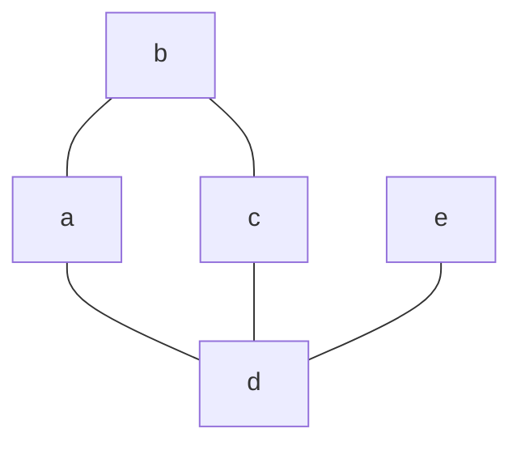
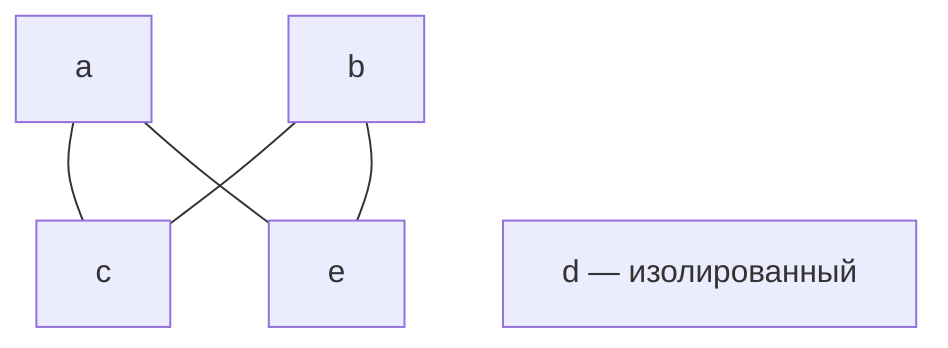
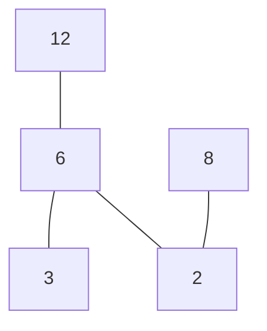

# Эквивалентность, частичный порядок и диаграммы Хассе

**Дата занятия:** 01.10.2026.

## Конспект

### 1. Эквивалентность, классы и разбиение множества

Бинарное отношение на множестве $A$ — подмножество $A\times A$. Запись $xRy$ означает $(x,y)\in R$.

**Отношение эквивалентности** одновременно обладает тремя свойствами:

| Свойство | Условие |
|---|---|
| Рефлексивность | Для каждого $x\in A$ выполняется $xRx$ |
| Симметричность | Из $xRy$ следует $yRx$ |
| Транзитивность | Из $xRy$ и $yRz$ следует $xRz$ |

Для эквивалентности **класс элемента** определяется так:

$$
[x]_R=\lbrace y\in A\mid xRy\rbrace.
$$

Семейство всех различных классов обозначается $A/R$ и называется **фактор-множеством**. Оно образует разбиение $A$:

1. Каждый класс непустой.
2. Разные классы не пересекаются.
3. Объединение классов равно $A$.

Почему это выполняется:

- Рефлексивность даёт $x\in[x]_R$; поэтому класс непуст и каждый элемент попадает хотя бы в один класс.
- Если два класса имеют общий элемент $z$, то симметричность и транзитивность позволяют показать, что эти классы совпадают.
- Следовательно, классы либо совпадают, либо не пересекаются.

Обратно, любое разбиение задаёт эквивалентность: два элемента связаны тогда и только тогда, когда лежат в одной части разбиения.

> **Обратите внимание.** Для произвольного отношения множества вида $\lbrace y\mid xRy\rbrace$ могут быть пустыми или пересекаться без совпадения. Называть их классами эквивалентности и считать разбиением можно только после проверки свойств отношения.

### 2. Три примера на множестве из трёх элементов

Пусть $A=\lbrace1,2,3\rbrace$.

#### Пример 1. Отношение без одной диагональной пары

$$
R_1=\lbrace(1,1),(2,2)\rbrace.
$$

Получаются множества:

$$
[1]_{R_1}=\lbrace1\rbrace,\qquad
[2]_{R_1}=\lbrace2\rbrace,\qquad
[3]_{R_1}=\varnothing.
$$

Отношение не рефлексивно на $A$, поскольку отсутствует $(3,3)$. Семейство содержит пустую часть и не покрывает элемент 3, поэтому разбиением $A$ не является.

#### Пример 2. Отношение равенства

$$
R_2=\lbrace(1,1),(2,2),(3,3)\rbrace.
$$

Оно рефлексивно, симметрично и транзитивно. Классы:

$$
A/R_2=\lbrace\lbrace1\rbrace,\lbrace2\rbrace,\lbrace3\rbrace\rbrace.
$$

Каждый элемент образует отдельный класс. Все три условия разбиения выполнены.

#### Пример 3. Пересекающиеся множества, которые не совпадают

В записи приведены:

$$
[1]_{R_3}=\lbrace1,2,3\rbrace,\qquad
[2]_{R_3}=\lbrace1,2\rbrace,\qquad
[3]_{R_3}=\lbrace1,3\rbrace.
$$

Они задают отношение:

$$
R_3=\lbrace(1,1),(1,2),(1,3),(2,1),(2,2),(3,1),(3,3)\rbrace.
$$

Рефлексивность и симметричность есть. Транзитивность нарушается:

$$
2R_3 1,\qquad 1R_3 3,\qquad 2\mathrel{\not R_3}3.
$$

Множества для элементов 2 и 3 пересекаются по элементу 1, но не совпадают. Они не образуют разбиение.

> **Обратите внимание.** Если отметка рядом с $R_3$ в записи означает эквивалентность, это ошибка. Для опровержения достаточно одной тройки $2,1,3$, нарушающей транзитивность.

### 3. Частичный, линейный и строгий порядок

**Нестрогий частичный порядок** — отношение $\preceq$, которое рефлексивно, антисимметрично и транзитивно.

Антисимметричность означает:

$$
(x\preceq y\ \land\ y\preceq x)\Longrightarrow x=y.
$$

Она допускает петли $x\preceq x$, но запрещает взаимную связь двух различных элементов.

Элементы **сравнимы**, если $x\preceq y$ или $y\preceq x$. Если ни одно из отношений не выполняется, элементы **несравнимы**.

**Линейный порядок** — частичный порядок, в котором любая пара различных элементов сравнима:

$$
\forall x,y\in A:\quad x\ne y\Longrightarrow
(x\preceq y\ \lor\ y\preceq x).
$$

**Строгий порядок** $\prec$ получается из нестрогого удалением равенства:

$$
x\prec y\Longleftrightarrow(x\preceq y\ \land\ x\ne y).
$$

Он иррефлексивен и транзитивен; из этих свойств следует асимметричность. Обратно, к строгому порядку можно добавить все пары $(x,x)$ и получить нестрогий частичный порядок.

> **Обратите внимание.** Антисимметричность не означает «отсутствие симметричности». Отношение равенства одновременно симметрично и антисимметрично. Асимметричность строже: из $xRy$ следует отсутствие $yRx$, в том числе при $x=y$.

### 4. Диаграмма Хассе: какие связи остаются

Диаграмма Хассе изображает конечное частично упорядоченное множество. Меньшие элементы располагают ниже больших.

Ребро между $x$ и $y$ проводят, когда $y$ **непосредственно покрывает** $x$:

$$
x\prec y,\qquad
\text{не существует }z\in A\text{ такого, что }x\prec z\prec y.
$$

При переходе от полного графа порядка к диаграмме:

1. Удаляют петли, соответствующие рефлексивности.
2. Удаляют связи, которые уже следуют из пути через промежуточные элементы.
3. Направление «от меньшего к большему» задают расположением снизу вверх.

Например, при $x\prec z\prec y$ связь $x\prec y$ сохраняется в отношении, но отдельное ребро между $x$ и $y$ на диаграмме не требуется.

> **Обратите внимание.** Геометрическое пересечение линий без отмеченной вершины не создаёт новый элемент. Если одна вершина нарисована выше другой, но между ними нет восходящего пути, это само по себе не означает сравнимость.

### 5. Минимальные, максимальные, наименьший и наибольший

Эти понятия относятся к выбранному множеству $A$ с его порядком.

| Понятие | Что требуется |
|---|---|
| Минимальный элемент $t$ | $\forall x\in A:\ x\preceq t\Rightarrow x=t$ |
| Максимальный элемент $t$ | $\forall x\in A:\ t\preceq x\Rightarrow x=t$ |
| Наименьший элемент $s$ | $\forall x\in A:\ s\preceq x$ |
| Наибольший элемент $g$ | $\forall x\in A:\ x\preceq g$ |

У минимального нет другого элемента ниже него, но он может быть несравним с некоторыми элементами. Наименьший сравним со всеми и меньше или равен каждому.

Аналогично максимальный не имеет другого элемента выше, а наибольший больше или равен каждому.

Минимальных и максимальных элементов может быть несколько. Наименьший и наибольший, если существуют, единственны: если $s_1$ и $s_2$ оба наименьшие, то $s_1\preceq s_2$ и $s_2\preceq s_1$, поэтому по антисимметричности $s_1=s_2$.

#### Первая диаграмма: ромб с дополнительной ветвью

Связи непосредственного покрытия: $d\prec a$, $d\prec c$, $d\prec e$, $a\prec b$, $c\prec b$.



*Схема первой диаграммы практики 01.10.2026.*

Восходящие пути дают $d\prec b$. При этом $a$ и $c$ несравнимы, а $e$ несравним с $a$, $c$ и $b$.

| Что ищем | Ответ | Обоснование |
|---|---|---|
| Минимальные | $d$ | Только у $d$ нет элемента ниже |
| Максимальные | $b,e$ | У этих вершин нет элемента выше |
| Наименьший | $d$ | Он меньше всех остальных, непосредственно или по пути |
| Наибольший | Нет | Ни $b$, ни $e$ не больше друг друга |

> **Обратите внимание.** В записи отсутствие наименьшего элемента для этой схемы указано ошибочно. По нарисованным рёбрам $d$ достигает каждого другого элемента, значит, он наименьший.

#### Вторая диаграмма: четыре связи и изолированный элемент

Связи: $c\prec a$, $c\prec b$, $e\prec a$, $e\prec b$. Элемент $d$ изолирован.



*Схема второй диаграммы практики 01.10.2026.*

Пересечение линий — не вершина. У $d$ есть только рефлексивная связь с самим собой; он несравним с остальными.

| Что ищем | Ответ | Обоснование |
|---|---|---|
| Минимальные | $c,d,e$ | Ниже них нет других элементов |
| Максимальные | $a,b,d$ | Выше них нет других элементов |
| Наименьший | Нет | Ни один из минимальных не меньше всех остальных |
| Наибольший | Нет | Ни один из максимальных не больше всех остальных |

> **Обратите внимание.** Изолированный элемент одновременно минимальный и максимальный. Наименьшим он здесь не является: $d$ не связан с $a$, $b$, $c$, $e$. Указание $d$ как наименьшего в записи нужно исправить.

### 6. Порядок делимости на конечном множестве

Пусть

$$
A=\lbrace2,3,6,8,12\rbrace,\qquad
x\preceq y\Longleftrightarrow x\mid y.
$$

Здесь $x\mid y$ означает: $y$ делится на $x$ без остатка. Это не обычное сравнение чисел по величине.

На положительных целых числах делимость — частичный порядок:

- $x\mid x$: рефлексивность.
- Если $x\mid y$ и $y\mid x$, то $x=y$: антисимметричность.
- Если $x\mid y$ и $y\mid z$, то $x\mid z$: транзитивность.

Различные связанные пары на выбранном множестве:

$$
(2,6),\ (2,8),\ (2,12),\ (3,6),\ (3,12),\ (6,12).
$$

Из диаграммы Хассе удаляем рёбра $2\to12$ и $3\to12$, потому что между концами есть промежуточный элемент 6. Остаются четыре ребра:



*Диаграмма Хассе для делимости, 01.10.2026.*

| Что ищем | Ответ |
|---|---|
| Минимальные | $2,3$ |
| Максимальные | $8,12$ |
| Наименьший | Нет |
| Наибольший | Нет |

Почему нет наименьшего: 2 не делит 3, а 3 не делит 2. Почему нет наибольшего: 8 не делит 12, а 12 не делит 8.

Порядок не линейный: например, 2 и 3 несравнимы.

> **Обратите внимание.** В рисунке вместо одной вершины 3 повторно подписана 6. Правильная диаграмма должна содержать каждый элемент множества ровно один раз: $2,3,6,8,12$.

### 7. Матрица отношения и проверка свойств

При фиксированном порядке элементов $a,b,c,d$ матрица отношения определяется так:

$$
m_{ij}=1\Longleftrightarrow x_iRx_j.
$$

Строка задаёт начало связи, столбец — конец.

В записи приведена матрица:

```math
M=\begin{pmatrix}
0&1&0&1\\
0&0&1&0\\
0&0&0&1\\
1&0&1&0
\end{pmatrix}.
```

Она задаёт пары:

$$
R=\lbrace(a,b),(a,d),(b,c),(c,d),(d,a),(d,c)\rbrace.
$$

#### Обычный и булев квадрат матрицы

Обычный квадрат считает количество путей длины 2:

```math
M^2=\begin{pmatrix}
1&0&2&0\\
0&0&0&1\\
1&0&1&0\\
0&1&0&2
\end{pmatrix}.
```

Например, из $a$ в $c$ есть два пути: $a\to b\to c$ и $a\to d\to c$, поэтому в первой строке третьем столбце стоит 2. Из $d$ в $d$ тоже есть два пути: через $a$ и через $c$; поэтому последний диагональный элемент равен 2.

Для композиции отношений важен только факт существования пути. В **булевом произведении** вместо сложения используется «или», вместо умножения — «и»:

$$
(M\odot M)_{ij}=\bigvee_k(m_{ik}\land m_{kj}).
$$

Булев квадрат:

```math
M\odot M=\begin{pmatrix}
1&0&1&0\\
0&0&0&1\\
1&0&1&0\\
0&1&0&1
\end{pmatrix}.
```

Матрица с нулями и единицами в записи соответствует булевому квадрату. Для обычного арифметического квадрата элемент $(1,3)$ равен 2.

#### Результаты проверки

| Свойство | Есть? | Доказательство или контрпример |
|---|---|---|
| Рефлексивность | Нет | На диагонали нули |
| Иррефлексивность | Да | Все диагональные элементы нулевые |
| Симметричность | Нет | $aRb$, но не $bRa$ |
| Антисимметричность | Нет | $aRd$ и $dRa$, хотя $a\ne d$ |
| Асимметричность | Нет | Та же взаимная пара |
| Транзитивность | Нет | $aRb$ и $bRc$, но не $aRc$ |
| Антитранзитивность | Да | Ни одна пара, полученная путём длины 2, не принадлежит $R$ |

**Транзитивность** в матричной форме означает: каждая единица булева квадрата должна быть единицей исходной матрицы.

**Антитранзитивность** означает:

$$
\forall x,y,z\in A:\quad (xRy\land yRz)\Longrightarrow\neg xRz.
$$

В примере единицы матриц $M\odot M$ и $M$ не совпадают ни в одной позиции. Следовательно, $R^2\cap R=\varnothing$, и отношение антитранзитивно.

> **Обратите внимание.** «Не транзитивно» и «антитранзитивно» различаются. Для первого достаточно одной нарушающей тройки; второе требует запрета прямой связи для каждого существующего пути длины 2. В этом примере доказано второе.

### 8. Как проверять отношение без пропусков

1. Зафиксировать множество и направление: что означает $xRy$.
2. Проверить диагональ: все петли, отсутствие всех петель или смешанный случай.
3. Проверить обратные пары: симметричность, антисимметричность, асимметричность.
4. Проверить пути длины 2: транзитивность и, если требуется, антитранзитивность.
5. Для эквивалентности проверить все три свойства, затем найти различные классы.
6. Для частичного порядка проверить рефлексивность, антисимметричность, транзитивность; только затем строить диаграмму Хассе.
7. Для линейного порядка дополнительно проверить сравнимость каждой пары различных элементов.
8. Для экстремальных элементов отдельно проверить четыре определения; не судить только по высоте вершины на рисунке.

Для опровержения универсального свойства достаточно контрпримера. Для подтверждения нужно общее доказательство либо проверка всех требуемых случаев конечного множества.

## Вопросы для самопроверки

**1. Какие три свойства определяют эквивалентность?**

<details>
<summary>Показать ответ</summary>

Рефлексивность, симметричность и транзитивность. Требуются все три.

</details>

---

**2. Какие условия должно выполнять разбиение множества?**

<details>
<summary>Показать ответ</summary>

Части непусты, попарно не пересекаются и в объединении дают всё исходное множество.

</details>

---

**3. Почему первое отношение на трёх элементах не является эквивалентностью?**

<details>
<summary>Показать ответ</summary>

Отсутствует пара $(3,3)$, поэтому нет рефлексивности на $\lbrace1,2,3\rbrace$. Множество, соответствующее элементу 3, пусто; семейство не является разбиением.

</details>

---

**4. Какой контрпример опровергает транзитивность третьего отношения?**

<details>
<summary>Показать ответ</summary>

$2R_3 1$ и $1R_3 3$, но пара $(2,3)$ отсутствует.

</details>

---

**5. Чем антисимметричность отличается от асимметричности?**

<details>
<summary>Показать ответ</summary>

Антисимметричность запрещает взаимные связи различных элементов, но допускает петли. Асимметричность запрещает любую обратную связь и поэтому исключает петли.

</details>

---

**6. Когда частичный порядок является линейным?**

<details>
<summary>Показать ответ</summary>

Когда любая пара различных элементов сравнима: $x\preceq y$ или $y\preceq x$.

</details>

---

**7. Какие связи показываются на диаграмме Хассе?**

<details>
<summary>Показать ответ</summary>

Только непосредственное покрытие: $x\prec y$ и между ними нет промежуточного $z$. Петли и связи, следующие из более длинных путей, не рисуются.

</details>

---

**8. Чем минимальный элемент отличается от наименьшего?**

<details>
<summary>Показать ответ</summary>

У минимального нет другого элемента ниже него. Наименьший меньше или равен каждому элементу множества. Минимальный может быть несравним с другими; наименьший — нет.

</details>

---

**9. Каковы четыре ответа для первой диаграммы?**

<details>
<summary>Показать ответ</summary>

Минимальный: $d$. Максимальные: $b,e$. Наименьший: $d$. Наибольшего нет, поскольку $b$ и $e$ несравнимы.

</details>

---

**10. Почему изолированный элемент во второй диаграмме не является наименьшим?**

<details>
<summary>Показать ответ</summary>

Он несравним со всеми другими элементами. При этом он одновременно минимальный и максимальный, поскольку у него нет другого элемента ни ниже, ни выше.

</details>

---

**11. Какие рёбра остаются для порядка делимости в разобранном примере?**

<details>
<summary>Показать ответ</summary>

$2\prec6$, $3\prec6$, $6\prec12$, $2\prec8$. Связи $2\prec12$ и $3\prec12$ следуют через 6, поэтому отдельных рёбер для них нет.

</details>

---

**12. Почему порядок делимости в примере не имеет наименьшего и наибольшего?**

<details>
<summary>Показать ответ</summary>

Минимальные 2 и 3 несравнимы; максимальные 8 и 12 тоже несравнимы. Ни один элемент не делит все остальные и ни один не делится на все остальные.

</details>

---

**13. Почему в обычном квадрате матрицы отношения появилась двойка?**

<details>
<summary>Показать ответ</summary>

Есть два пути длины 2 из $a$ в $c$: через $b$ и через $d$. Обычное произведение считает пути; булево фиксирует только их существование и даёт 1.

</details>

---

**14. Как по матрицам отличить транзитивность от антитранзитивности?**

<details>
<summary>Показать ответ</summary>

Для транзитивности все единицы булева квадрата должны содержаться среди единиц исходной матрицы. Для антитранзитивности у них не должно быть ни одной общей единицы. В разобранном примере выполняется второе.

</details>

## Самое важное — теоретический минимум

- **Эквивалентность:** рефлексивность, симметричность, транзитивность; классы образуют разбиение.
- **Частичный порядок:** рефлексивность, антисимметричность, транзитивность; линейный — все элементы сравнимы.
- **Хассе:** только непосредственное покрытие; сравнимость читается по восходящему пути.
- **Минимальный:** нет меньшего элемента. **Наименьший:** меньше или равен каждому. Для максимального и наибольшего — наоборот.
- **Композиция:** булев квадрат показывает пути длины 2; антитранзитивность — $R^2\cap R=\varnothing$.
